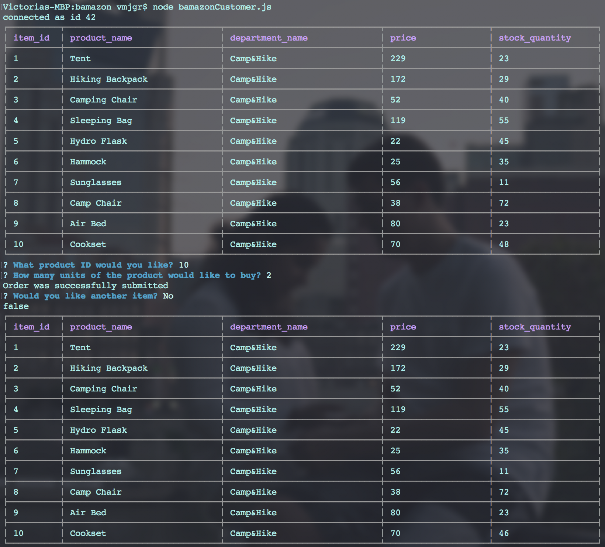

# bamazon

bamazon is a command line based app similar to amazon.

## Running the app

- Clone this repository to your machine
- In your terminal or command line change directory to bamazon folder
- Run the following code in the terminal/command line:
    ```
    npm install
    ```

## How to use?

To run this app, type the following commands into your terminal or command line and hit enter:
```
node bamazonCustomer.js
```
This command will display all the products bamazon has to offer.

User will be prompt to select the item they would like, and the number of items they would like to purchase. 

If the product is available, order would be submitted and total cost for items will be posted on the command line and inventory will be updated.

If the inventory is not available, the command line will display "Insufficient quantity!".

## Preview

User bamazon preview 


